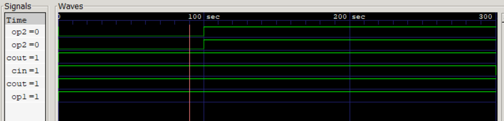

如果不安装vivado，同样也可以对简单的电路进行仿真、查看波形实验。下面使用的是Icrus verilog进行简单地演示。

```verilog
module adder(input op1,input op2,input cin,output res,output cout);
	assign {cout,res}=op1+op2+cin;
endmodule

module tb_adder();
	reg op1;
	reg op2;
	reg cin;
	wire res;
	wire cout;
	initial begin
		$dumpfile("test.vcd");
		$dumpvars(0,tb_adder);
		$monitor("%g\t %b %b %b %b %b",$time,op1,op2,cin,res,cout);
		op1=1;
		op2=0;
		cin=1;
		
		#100
		op2=1;
		
		#200
		cin=0;
		
		
	end
	adder m_adder(op1,op2,cin,res,cout);
endmodule
```

- 这里将test_bench和adder写在了一起。

- 在testbench中必须加上下面两句话

  ```verilog
  $dumpfile("filename.vcd");
  $dumpvars(0,"tb_name");
  ```

然后可以进行编译

```bash
 iverilog -o <filename> <sourcename.v>
```

执行文件

```bash
vvp <filename>
```

查看波形

```bash
gtkwave <filename.vcd>
```



注意最后一个变化会成为一条线，可能不是那么明显。
